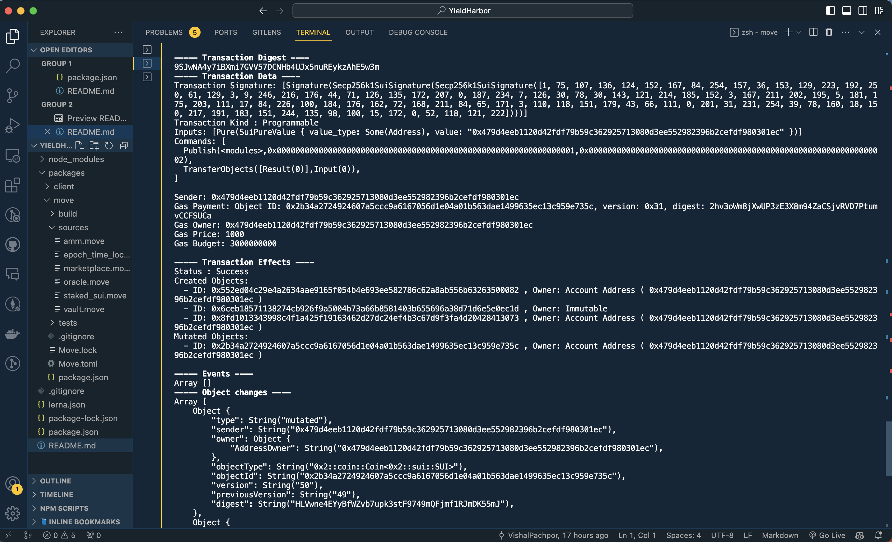

# YieldHarbor Finance

## Introduction

YieldHarbor Finance is a decentralized financial protocol engineered for the Sui blockchain. It empowers users to tokenize their liquid staking assets, offering enhanced flexibility in managing staked capital and optimizing market opportunities. This README provides a comprehensive overview of YieldHarbor Finance, detailing its key components and functionalities.

## *Table of Contents*

1. [Protocol Overview](#protocol-overview)
2. [Background](#background)
3. [Derivative Tokens](#derivative-tokens)
4. [Marketplace for HYT && YT](#marketplace-for-hyt)
5. [Contract overview](#contract-overview)

## Protocol Overview

- Permissionless Yield Tokenisation: Tokenise your liquid staking assets on the Sui blockchain, no permissions required.
- Staking Strategies: Innovative strategies enable users to hedge staking risks by fixing today's APR and pre-selling yield.
- Arbitrage Opportunities: For those not interested in staking, capitalize on market inefficiencies through arbitrage of future yield tokens.


## Background

YieldHarbor is initially compatible with Staked SUI objects—semi-NFTs obtained by staking SUI tokens with a validator. These objects offer pool-specific rewards and cannot be merged across different pools. A unique mechanism calculates an accurate average APR, consolidating rewards from various staking pools.

## Derivative Tokens

YieldHarbor introduces two types of derivative tokens minted via the timelock vault:

-Principal Token (HYT)

- Principal Tokens (HYT) represent liquid staking assets and future yield.
- HYT tokens are created in timelock vaults with fixed maturity dates.
- Before maturity, the vault accumulates yield from the staking protocol or validator node, ensuring that HYT holders can redeem assets at a 1:1 ratio when the vault matures.
- A shared function can be executed to unstake locked Staked SUI objects, add rewards to the pool, and restake remaining Staked SUI objects if the APR remains fixed.

-Yield Token (YT)

- YT tokens help stabilize the reward pool and ensure sufficient assets for stakers.
- YT tokens are minted at the time of vault generation and supply liquidity to the AMM's pool.
- YT primarily targets speculators interested in APR changes.
- YT holders can claim excess yields during APR uptrends, converting LP tokens into rewards during downtrends.


## Marketplace for HYT

- HYT is a fungible token that can be traded on any exchange, including YieldHarbor's marketplace.
- Sellers can set discounts to attract buyers, making an orderbook-based system more suitable.

## Marketplace for YT

- YT utilizes an AMM for instant trading without order creation, with token price determined by supply and demand.

## Burning Process for HYT

- When the vault matures, HYT token holders can redeem their assets at a 1:1 ratio.
- If the vault hasn't matured, exiting the position requires acquiring YT tokens equivalent to the remaining future yield not yet acquired by the vault.


## Contract Overview

The project employs a monorepo structure with two packages:

- `client`: The frontend application built with React, TailwindCSS, Sui.js, and Suiet's wallet-kit.
- `move`: Contains Move-based smart contracts for the protocol's core functionality.

Key smart contracts include:

- `staked_sui.move`: A mock Staked SUI object for testing on the Testnet system.
- `vault.move`: The timelock vault that mints HYT and manages principal tokens.
- `oracle.move`: The Oracle contract for APR value updates.
- `marketplace.move`: An orderbook-based marketplace for trading HYT.
- `amm.move`: An AMM-based marketplace for trading YT tokens.

YieldHarbor Finance offers a comprehensive ecosystem for managing liquid staking assets and capitalizing on APR fluctuations on the Sui blockchain.

## Getting started

We can then run the unit tests for all YieldHarbor's smart contracts by:

```
npm run test
```

And to start the frontend application, we need to installing dependencies with:

```
npm run bootstrap
```

Then run

```
npm run package:client
```

## Deployment

### Sui Devnet

Deployment transaction link - https://suiexplorer.com/txblock/9SJwNA4y7iBXmi7GVV57DCNHb4UJx5nuREykzAhE5w3m?network=devnet


| Name    | Address                                                            |
| ------- | ------------------------------------------------------------------ |
| Package | 0x6ceb18571138274cb926f9a5004b73a66b8581403b655696a38d71d6e5e0ec1d |

| Vault   | 0xd2cbc949e7ea2de2ffc6b77c9e5d900be21986a7afa002d677e2cb39839ffc1a |

Sui Devnet Deployment
[]()
